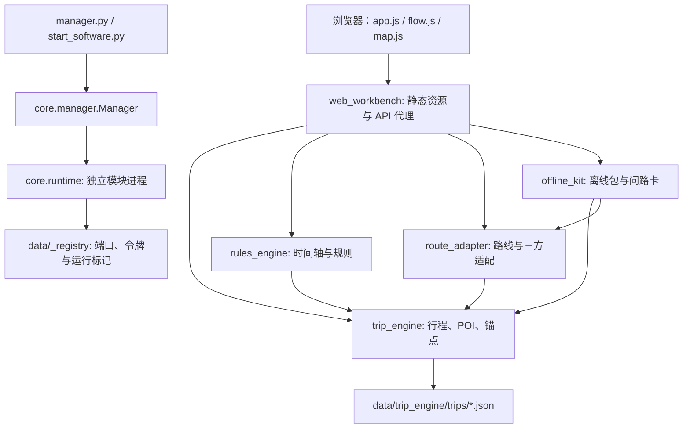

# 架构与 Bug 检查报告

## 后续修复状态（2026-10-03）

经用户授权，前五项已修复，第六项锚点契约字段问题保留。本报告下方的发现、行号及审查复现结果记录的是修复前状态。

| 项目 | 修复行为 | 回归证据 |
| --- | --- | --- |
| 并发覆盖 | 读、版本检查、提交共用行程事务锁；删除、复制、添加、排序、移除和跨天移动也受保护 | 相同版本的两个 HTTP PATCH 返回 200 / 409；并发添加保留两个点位并递增两次版本 |
| 冲突确认 | 后端解码 notice_id 路径段 | 贯通测试使用页面一致的 %3A 路径，确认保留成功，并继续生成离线包 |
| 外部依赖 | 依赖检查与告警纳入外部实例；运行中配置、卸载、停止依赖约束采用相同判活依据 | 真实外部 /health 服务下可启动依赖它的模块，不出现“依赖已停止”误告警 |
| 端口复用 | 注册成功时另存 data/_registry/_ports/<id>.json，仅含端口；停服清理实时注册而保留历史 | 正常停服后注册文件不存在、端口仍能解析；实际 route_adapter 停止再启动复用同一端口；占用端口仍回落自动分配 |
| 离线包字段 | 打包结果包含 name_zh、name_en、data_source | Python 包含字段测试、HTTP 流程测试及真实 Python 打包器 → JS HTML 渲染测试通过，标题和演示警告可见 |

验证：核心及集成全量 142 个通过，随后新增的真实服务端口重启用例也通过（当前核心共 143 个）；规则 75 个、路线 44 个、离线 14 个通过，合计 276 个 Python 用例。六组 Node 测试通过；契约校验 155 项失败 0、运行时自检通过、生成产物无不同步。

未改动旧行程字段、契约 schema、前端页面资源及现有用户行程。端口历史从更新后的服务首次登记开始保存；升级前已经被删除的历史端口无法恢复。旧离线包中缺失的字段也不会自动补齐，需要重新生成。进程内事务锁覆盖单个行程服务的 HTTP 并发，部署方式仍要求只运行一个 trip_engine 实例。

修复前的 `docs/audit/audit_reproduce_before_fixes.py` 是审查留档脚本，其断言期待旧故障，修复后不要用它作为通过判据；请使用新增回归测试和现有测试套件。后续问题合集修复已完成真实本地服务的浏览器交互验收；真实三方API仍因缺少Web服务key而未实测，见《问题合集修复与验收-2026-10-03.md》。

---

检查日期：2026-10-03。检查对象：当前交付目录中的源码与测试；目录未包含 Git 仓库，无法核对提交历史或分支差异。本次未修改业务源码、现有配置或行程数据。

## 架构

项目是本机单用户、标准库为主的 Python 多进程应用。每个模块由 `core/runtime.py` 在独立 spawn 进程中加载 `plugin.py`；模块内部使用多线程 HTTP 服务。浏览器使用原生 JavaScript，没有前端构建流程。

管理控制台 `manager.py` 和整套软件启动器 `start_software.py` 共用 `core/manager.py`。管理器负责发现、安装、依赖、启停、配置、日志及外部实例识别；启动器增加拓扑分层启动和健康等待。

硬依赖：`rules_engine → trip_engine`、`route_adapter → trip_engine`、`offline_kit → trip_engine + route_adapter`、`web_workbench → trip_engine`。网页工作台将其余三个业务模块作为可选能力，允许降级展示。

行程唯一写入方是 `trip_engine`，按行程保存 JSON，通过临时文件加原子替换落盘。规则模块通过 HTTP PATCH 写回时间轴和 notices；路线模块提供结果，由网页工作台选择后 PATCH 写回行程；离线模块读取行程快照生成包。`contracts/` 提供 schemas、规则、映射、生成模型和公共注册表。模块间通过注册文件发现端口，使用 `X-Module-Token` 鉴权；浏览器通过工作台代理访问上游。

## 已复现的问题

### 1. [P1] 两个带相同 If-Match 的并发更新都成功，后写覆盖先写

位置：`modules/trip_engine/engine.py:281`、`:657`、`:861`。

`patch_trip()` 读文件后检查版本，随后修改并保存；这整个过程没有行程级锁。HTTP 服务允许并发线程，两次请求都可以读取 version=1、通过版本检查，再分别保存 version=2。原子替换只保证文件完整，不能保证读改写事务。

复现：在两次读取后设置同步屏障，通过真实 HTTP 同时提交 `pacing=packed` 和 `daily_start_local=11:00`，都带 `If-Match: 1`。结果两个 HTTP 200，最终 version=2，节奏仍是 balanced，节奏更新丢失。

影响：多个标签页、规则写回与用户编辑重叠时，会静默丢失已成功提交的修改。其他 add/remove/reorder 的读改写同样没有事务保护。

建议：为同一行程的全部修改统一串行化，版本检查放在锁内；相同版本的第二个 PATCH 应返回 409。不要仅给文件写入加锁。

### 2. [P1] 页面“仍然保留”按钮无法确认闭馆冲突

位置：`modules/web_workbench/web/flow.js:248`、`modules/rules_engine/engine.py:393`。

前端用 `encodeURIComponent(id)` 构造 URL，把 `rule_01_closure:1:sh_poi_00088` 转成带 `%3A` 的路径段。规则服务将原始路径段直接交给 `confirm()`，没有 URL 解码，`parse_notice_id()` 按冒号拆分失败。

复现：同一景点、同一 decision，编码后的路径返回 HTTP 400 / BAD_REQUEST / notice_id 格式非法；未编码路径返回 HTTP 200。

影响：页面确认保留失败，用户无法完成该冲突的确认流程；生成离线包也会被未确认硬冲突阻挡。现有 HTTP 流程测试直接使用未编码 ID，因此未发现问题。

建议：在后端路由边界对 notice_id 路径段解码，并补一条使用页面实际编码路径的贯通测试。

### 3. [P2] 已运行的外部依赖仍被判定为“请先运行依赖”

位置：`core/manager.py:66`、`:276`。

`list()` 已能把外部实例显示为 running，但 `start()` 检查依赖仍只调用 `_running()`，后者仅查看当前 Manager 的 `self.processes`。

复现：临时目录里部署 trip_engine 和依赖它的 rules_engine，给 trip_engine 注册一个真实响应 /health 的外部 HTTP 服务。列表显示 trip_engine 为 running/external=true；启动 rules_engine 仍报“请先运行依赖：trip_engine”。

影响：一个窗口已启动 trip_engine，另一窗口补启依赖模块会失败；启动器跳过已经运行的外部依赖后，启动缺失的下游也会遇到同样问题。

建议：区分“本管理器拥有的进程”和“模块实际在运行”，依赖校验与告警使用包含外部实例的统一判活逻辑。

### 4. [P2] 正常停止会清掉端口记忆，重启端口复用失效

位置：`contracts/runtime/registry.py:129`、`:409`；五个服务模块的停止路径均调用 remove。

`resolve_port()` 只能从注册文件读取上次端口，但 `remove()` 正常停服时删除同一注册文件。下次启动无法取得记忆，返回 0 请求随机分配。

复现：写入一个已退出实例的有效端口记录，resolve_port 返回该端口；执行模块停服使用的 remove 后，再次 resolve_port 返回 0。

影响：正常关机重启时旧书签仍可能失效。已有端口测试人工保留注册文件，覆盖的是“退出后残留记录”而非正常停服路径。

建议：把历史端口单独持久化，实时注册记录继续按生命周期清理，避免用残留令牌记录充当端口记忆。

### 5. [P2] 离线包丢失 mock 标识和景点名称

位置：`modules/offline_kit/package.py:56`、`modules/web_workbench/web/flow.js:386`。

`_build_stop()` 输出不含 `data_source` 和景点名称；离线 HTML 却根据 `stop.data_source === 'mock'` 显示演示警告，并从 `stop.name_zh` 读取标题。

复现：输入含 `transit_from_previous.data_source=mock` 和终点双语名称的停靠点，生成结果没有上述字段，mock 警告条件为 false。

影响：导出的离线 HTML 丢掉“演示路线，不能用于真实导航”的标记，标题退化成 sh_poi_00042 等内部 ID。问路卡内容中仍可能出现真实名称，但标题和来源标记缺失。

建议：明确离线契约的名称、来源及降级字段，打包端与渲染端采用同一结构，增加从真实 packager 输出到 HTML 的测试。

### 6. [P2] 实际创建的行程违反自身契约 schema

位置：`modules/trip_engine/engine.py:125`、`contracts/schemas/trip.schema.json:41`、`:56`。

引擎把输入的锚点时间 `at` 原样保存；契约要求抵达锚点为 `arrival_at`，离境锚点为 `departure_at`，并禁止额外字段。

复现：直接将 create_trip 的实际返回值交给 generated/schema_store.validate，返回“arrival_at 必填”和“额外字段 at 不允许”。离境锚点沿用相同的 `_validate_anchor()` 输出，也存在字段不一致。

影响：现有模块之间因为共同使用 at 暂时能运行，但按契约校验或接入生成模型的客户端会拒绝行程；契约自检验证的是样例，并非真实创建输出。

建议：统一请求 DTO 与持久化领域对象的映射；保存和响应使用契约字段。修改时需要同步前端和锚点时间消费者，并考虑旧行程兼容。

## 验证结果与边界

| 检查 | 结果 |
| --- | --- |
| Python 核心与集成测试 | 136 通过 |
| rules_engine 测试 | 75 通过 |
| route_adapter 测试 | 44 通过 |
| offline_kit 测试 | 13 通过 |
| 六组 Node 前端测试 | 全部通过；workbench_wiring 为 93/93 |
| contracts/scripts/validate.py | 155 项，失败 0 |
| contracts/scripts/check_runtime.py | 全部通过 |
| contracts/scripts/generate.py --check | 无不同步产物 |
| 独立审查复现 | 以上六项全部复现 |

复现脚本位于项目上级 `docs/audit/audit_reproduce_before_fixes.py`；只作为修复前的历史证据保留，不再作为通过判据运行。脚本在独立 audit-data 目录内创建测试数据、临时本机 HTTP 服务，并在结束时关闭服务，不读取或修改用户行程。并发问题使用屏障确定性地重现允许出现的请求交错。

本次没有启动用户的整套软件，没有在真实浏览器中点击页面，也没有调用高德等真实三方 API。前端结论来自实际页面代码、现有 Node 测试及与页面一致的 HTTP 路径复现。腾讯/百度适配骨架、日落数据源、收尾路段持久化等已在交付说明中标为未完成，不计入本次新发现 Bug。

优先处理并发数据覆盖和冲突确认按钮，再处理外部依赖判活及离线来源丢失。测试全部通过不能代替跨层输入输出的一致性验证。
